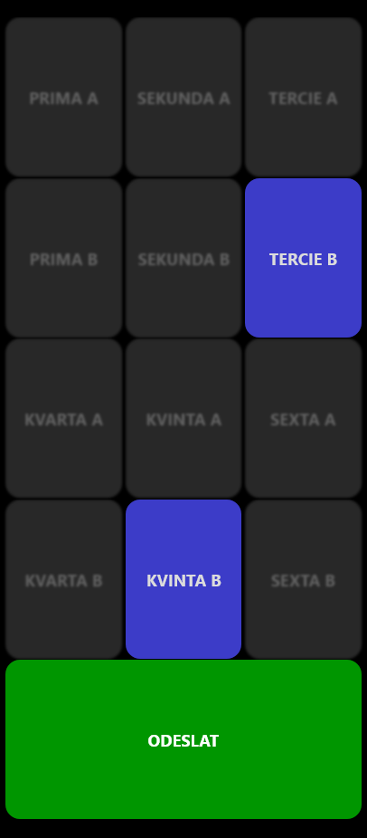
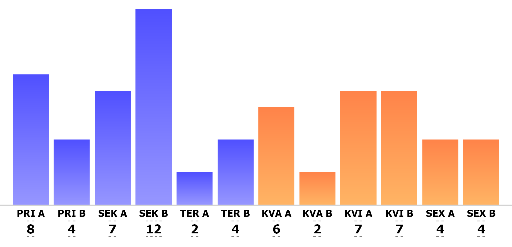
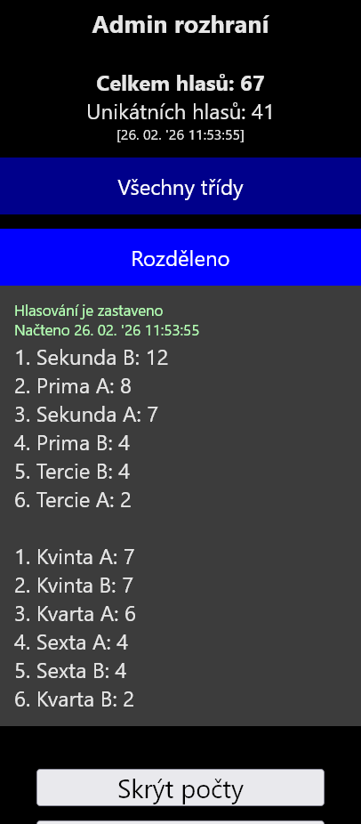

# Majáles voting system: hlasovací systém pro Majáles Gymnázia Brno-Řečkovice
This is a slightly refactored version of the voting system used on Majáles 2022 and 2023 of Gymnázium Brno-Řečkovice.

[Online demo](https://lan.rickmt.com:4000/pub/majales/) (user: `userpassword`, admin: `adminpassword`; voting rate limiting is set)

Specific people are assigned the role of a vote collector to collect votes from the event attendees. Two votes can be submitted at most; one in each category (lower and higher grades). See below for a detailed use case description.

Add a feature request if you wish the voting system to work for your use case, if it differs.

# Setup
The app is relatively simple and can be run on any PHP7+/MySQL web server/hosting.

Minimal setup process:
- Clone the repository into your web server directory
- Adjust the configuration in `env.php` (or create a copy named `env.local.php`)
- Read the usage manual and get used to the UI

## PHP configuration script
The script allows you to set up config such as the user and admin passwords and DB login credentials. It also contains some reusable logic and creates the table used for storing the votes, if it does not exist.

## Access control
All PHP scripts redirect to the login page if the user is not authorized. This does not apply to non-PHP assets.

If desired, set up rules in your `.htaccess` script for all assets in the repository except `login.php` to redirect to `login.php` if the user cookie (`USER_COOKIE_NAME`) does not contain the expected password hash.

# Usage / voting procedure
Description of the system use case.

## General procedure
Once the voting starts on the Majáles event, the moderators may decide to show the live chart on the big screen. If the voting is disabled in the admin interface, a moderator enables it.

Several people (users) are assigned the role of a vote collector and are stationed around the area of the Majáles event. Attendees come to these collectors and tell them their chosen vote. The collector enters the vote into the UI and submits it. Attendees may be marked (ie by a stamp on the wrist) to show that they have already voted.

The voting is split into two categories: lower (pri, sek, ter) and higher (kva, kvi, sex) grades. A vote in each category can be submitted. Voting in both categories submits a single vote for each chosen grade. Voting in a single category submits one vote for the chosen grade.

Once the voting time slot has ended, a moderator may disable voting in the admin interface. No votes can be submitted and the chart may be displayed on the big screen, showing the final results.

## App UI usage
All users (vote collectors, moderators) are given the password (`USER_PASSWORD`) to log into the app.

The collectors will be using the *Hlasování* page to submit votes. The live result chart is displayed on the *Živý graf* page; it fetches results periodically.

### Admin interface
The admin interface can be accessed through *Admin. rozhraní a výsledky*. It is to be accessed by moderators only using their password (`ADMIN_PASSWORD`).

The interface shows a sorted summary of the voting results, either as a whole or grouped by grade category. Since these results are only meant to be read once the voting had ended, they do not refresh automatically (unlike the live chart).

A moderator may enable or disable voting, or change the display of the live chart (show/hide vote counts, show a countdown). Changing these settings does not require the live chart page to be reloaded manually.

If any votes were submitted during testing, they can be removed. These votes are only marked as removed, in case their removal was not intentional.

# Testing
The system had been previously used on Majáles 2022 and 2023. No significant issues or flaws were observed.

Observed minor issues:
- The live chart does not visually update, if the window is minimized (ie when capturing it using OBS and outputting it to the big screen) - should not be an issue if simply showing the entire screen.
- The vote submission page occasionally shows an error, the votes submit on the 2nd attempt: probably fixed by adding retry logic to the submission JS.

## Testing prior to the event
You should definitely test the system prior to the event. Ideally on multiple devices, test the following:
- Both the user and admin logins work
- The voting submission works (try submitting votes for a single category and both categories)
- The live chart updates accordingly
- The voting can be disabled and the chart display can be changed in the admin interface
- After the testing is finished, the test votes are successfully removed using the admin interface

# Different usage of the voting system
While the voting system is tailored to the use case described above, you are obviously free to modify it as you wish. Described below are slightly different use cases that the system could be adapted for relatively easily.

If you wish, you can submit a feature request which I will be more than happy to implement if it is not too complex.

## Voting without vote collectors
The event attendees open the voting system directly and vote themselves.

Both `ajaxVoter.php` and `vote.php` must be accessible without user login (ie add `$nonauth = true;` before the include). The attendee is given a link to the latter.

To prevent the submission of multiple votes from one attendee, you could pre-generate a set of one-use credentials (eg hashes, random numbers) and store them in an SQL table. These credentials would be submitted to the voting page using a GET parameter; you could pre-generate voting tickets (with QR codes) which would then be printed and given to each attendee on entry. One way to do this is using a tool such as *dompdf* or simply generating the tickets as pictures, which would then be printed.

## Voting not limited to one vote per category
The attendee can give at most 2 votes to any grade.

Adjust the vote submission logic in `send.js` and `ajaxVoter.php` (ie the if-clauses) to not restrict each vote to their respective grade category.

# About the code
This app was written back in 2022 in a relative hurry with no intentions to publish it. The code is a mess and I am well aware of it.

To read a more thorough explanation as to why it's in this state (or to see an explanation of the warcrimes commited here), see the `readme.md` and the code in the `old` branch, containing the original code prior to refactor.